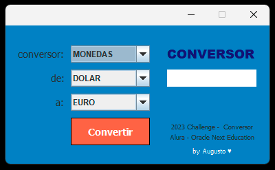
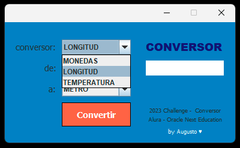
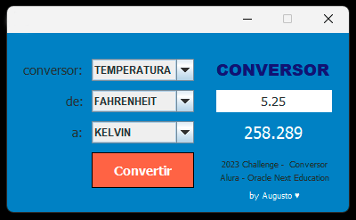

# Conversor - Challenge ONE | Oracle + Alura | Java

Conversor de unidades creado con fines educativos en el marco del programa ONE-Oracle Next Education 2023.
La aplicación permite convertir unidades de moneda, longitud y temperatura.

## Como utilizarlo 🛠️

* Selecciona el tipo de conversor: Monedas, Longitud o Temperatura.
* Elige la unidad inicial y la unidad a convertir.
* Introduce un valor numérico positivo.
* Presiona el botón convertir para ejecutar los cálculos.
* Se mostrará el resultado de la conversión.

### Manejo de errores

La aplicación mostrará un mensaje de error cuando:
* Se intenta convertir un valor que contiene letras y/o simbolos.
* Se intenta convertir un valor negativo para los conversores de monedas y longitud. 

### Instalación

* Puedes ejecutarlo directamente desde el archivo: conversor.jar
* Puedes abrirlo importandolo en tu IDE de desarrollo.

## Capturas 📷

## Notas 📝

### Uso de la información

Esta aplicación fue creada solo con fines educativos, los resultados pueden no ser totalmente precisos. Los valores utilizados para la conversión de monedas son ficticios, por lo que no representan las tasas de cambio reales.

### Mejoras posibles

* Agregar otros tipos de conversores.
* Conexión con una API para obtener actualizaciones en tiempo real del valor de las monedas.
* Conversión automática, eliminando el boton "convertir".